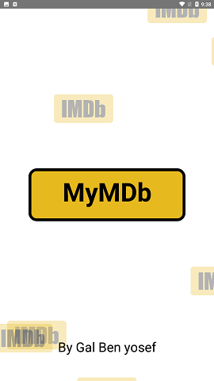
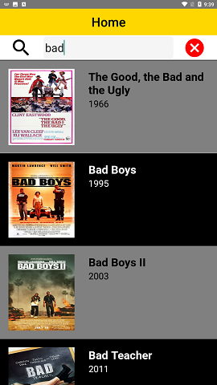
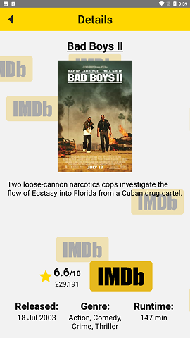

# MyMDb

React Native Application exercise (ZoomInfo)

Presents movies from omdbapi by title search

Screens
- [x] Animated SplashScreen
- [x] Animated Background
- [x] Home Screen
- [x] Details Screen
- [x] Dynamic Search

Best Practices
- [x] Pure functional components (es6)
- [x] Redux actions/actiontypes/reducer/selectors
- [x] Redux thunk - await/async actions
- [x] Optimized list (FastImage and memoization)
- [x] Paginated list (async api calls)
- [x] Normalized fonts - screen sizes compatibilty

Images

